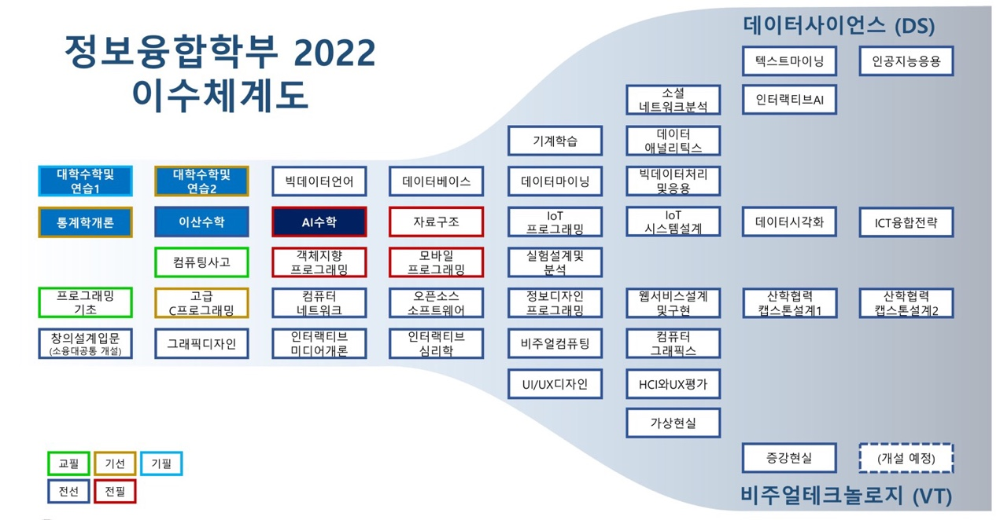
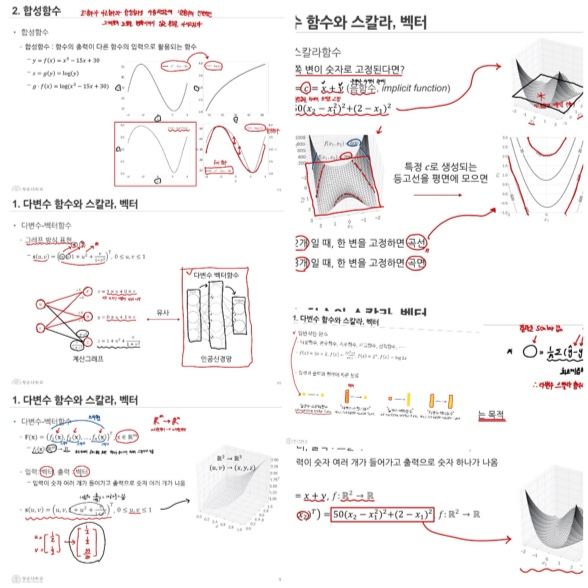
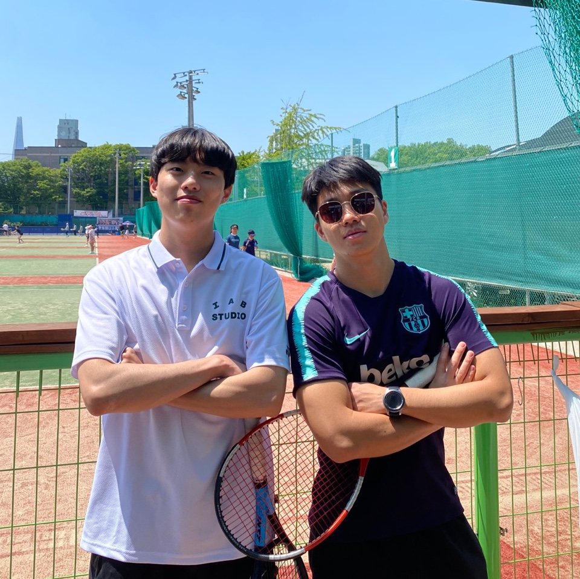
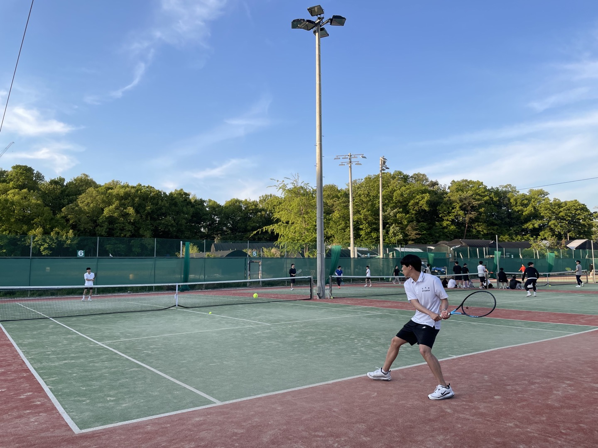
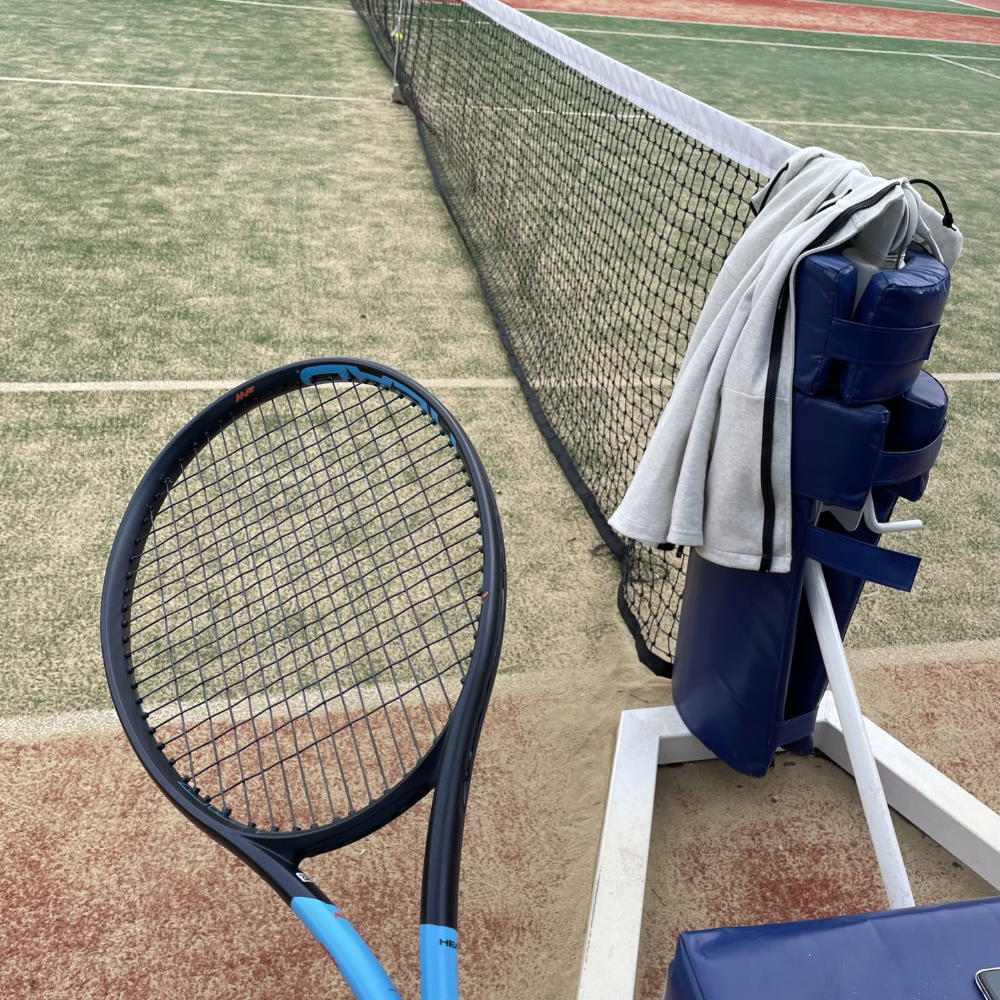
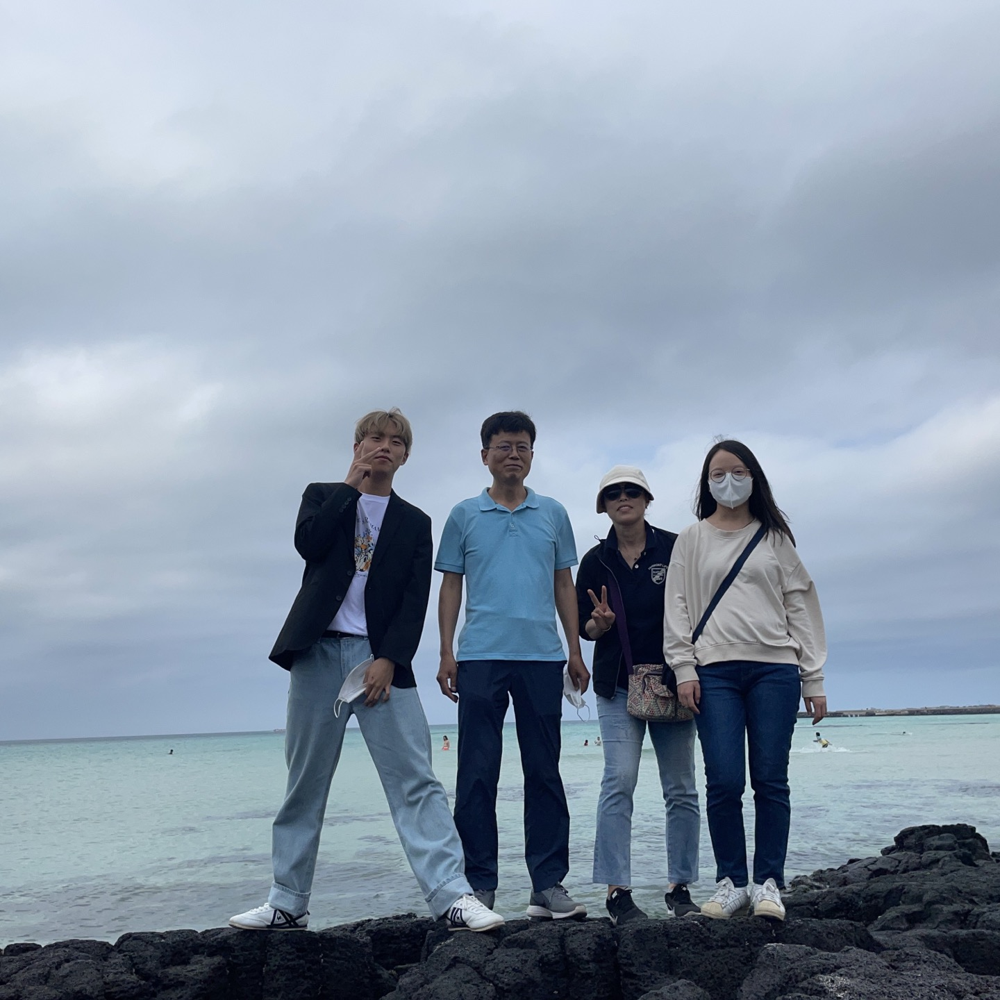
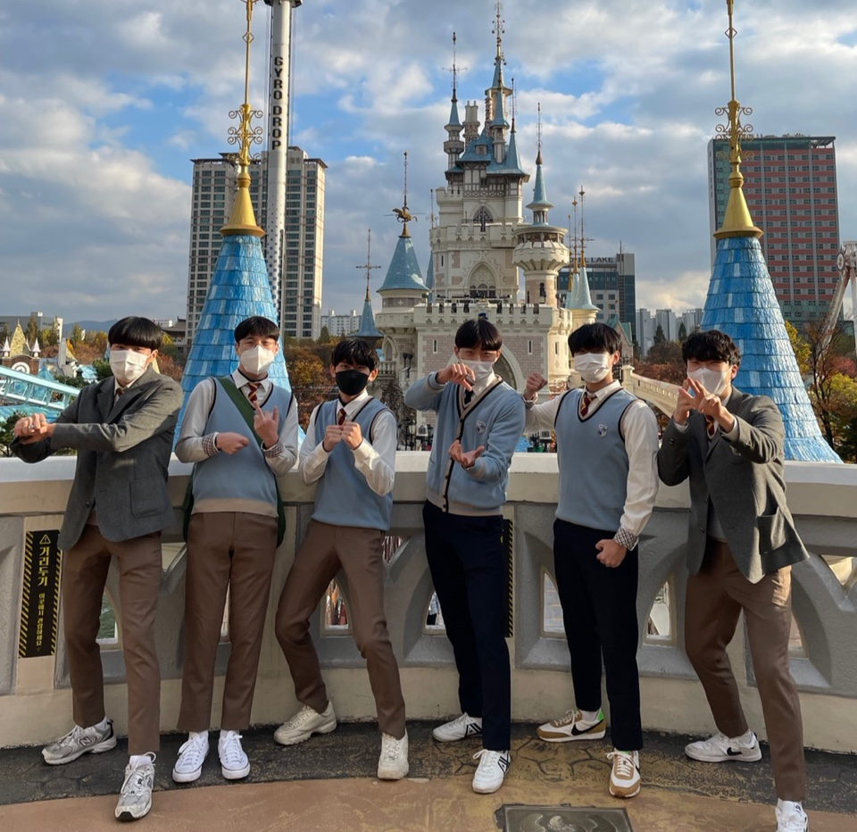
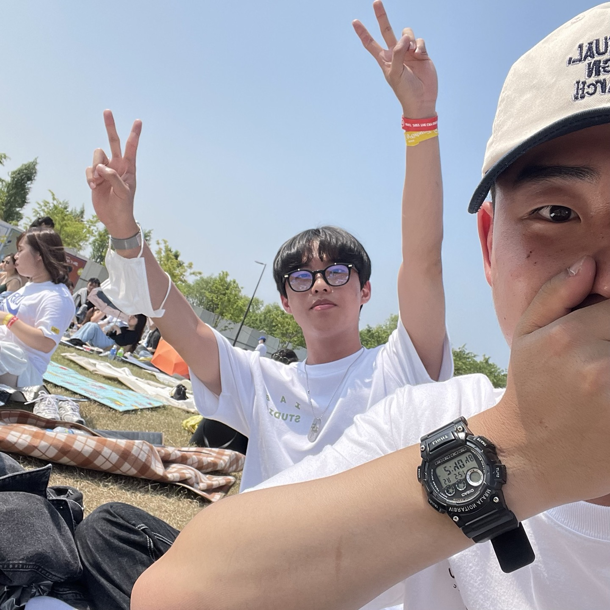

<!DOCTYPE html>
<html lang="en">
  <head>
    <!--글씨 안깨지게-->
    <meta charset="UTF-8" />
    <meta name="viewport" content="width=device-width, initial-scale=1.0" />
    <title>LeeTaeYeon intro</title>
    <!--링크에 아이콘 걸기-->
    <link rel="icon" type="image/jpg" href="imgs/realme.jpg" />
    <link rel="stylesheet" href="style.css" />
  </head>

  
  <body id="home">
    <header>
      <a href="인터렉티브_기말_이태연.html" class="logo">TaeYeon introduction</a>
      <nav>
        <ul>
          <li><a href="#home">Home🏠</a></li> <!-- 누르면 Home으로 돌아오기 -->
          <li><a href="https://github.com/KcNewbee/KcNewbee">GitHub💻</a></li> <!-- 누르면 github로 이동 링크 -->
          <li><a href="https://blog.naver.com/dlxodus890" target="_blank">->Blog</a></li> <!--블로그 링크 걸기, 새창에서 열기-->
        </ul>
      </nav>
    </header>

    <section class="home">
      

        <!--div는 줄바뀜 되지만 span은 줄바꿈 안됨-->
        <!-- 의미 강조 strong 태그 사용 -->
        

          hello! my name is <strong>TaeYeon Lee.</strong>
        

        

          I am <strong>21 years</strong> old.
        

        

            I am studying at Kwangwoon University in<a href="#about__major">'Information Convergence'</a>.
          

        
 
          I love Playing <a href="#about__tennis">tennis</a> and
          Playing <a href="#about__game">game</a>!
        

        

            Thank you to <a href="#about__everyone">everyone around me.😊
        

        

            <em>Now I'm getting to know what I want to do :)</em>
        

      

       <!--alt넣어주기-->
      

        

          안녕하세요! 저는 <strong>이태연</strong></a
          >입니다.
        

        

          저는 올해로 <strong>21살</strong>이에요.
        

        

          저는 광운대학교<a href="#about__major">'정보융합학부'</a
          >에 재학중입니다.
        

        

          <a href="#about__tennis">테니스</a
          >치는 것과 <a href="#about__game">게임</a
          >하는 것을 좋아해요!
        

        

            제 주변에 있는 <a href="#about__everyone">모든 이들에게 감사해요😊
        

        

          <em>현재는 내가 하고 싶은 것이 무엇인지 알아가고 있습니다 :)</em>
        

      

    </section>
    <section class="about">
        
<h1>Information Convergence</h1>

        

            
            
            
        

        
<h1>Tennis</h1>

        

            
            
            
        

        
<h1>Game</h1>

        

            
            
        

        
<h1>precious people</h1>

        

            
            
            
            
        

        
<h1>등장인물 정보</h1>

        

            <table>
                <caption>*사진에 나오는 인물 설명*</caption>
                <thead>
                    <tr align="center">
                        <th scope="col" width="150">사진명</th>
                        <th scope="col" width="400">등장인물 이름</th>
                        <th scope="col" width="150">장소</th>
                    </tr>
                </thead>
                <tbody>
                    <tr align="center">
                       <td>Tennis-Picture 01</td>
                       <td>백근형</td>
                       <td>서울테니스클럽</td>
                    </tr>
                    <tr align="center">
                       <td>Tennis-Picture 02</td>
                       <td>이태연</td>
                       <td>서울테니스클럽</td>
                    </tr>
                    <tr align="center">
                        <td>Game 01</td>
                        <td>Player: 이태연</td>
                        <td>.</td>
                    </tr>
                    <tr align="center">
                        <td>Game 02</td>
                        <td>Player: 박재훈</td>
                        <td>.</td>
                    </tr>
                    <tr align="center">
                       <td>Precious People 01</td>
                       <td>아버지, 어머니, 누나, 이태연</td>
                       <td>제주도</td>
                    </tr>
                    <tr align="center">
                        <td>Precious People 02</td>
                        <td>박재훈, 문예창, 김도우, 김기오, 이태연</td>
                        <td>롯데월드</td>
                     </tr>
                     <tr align="center">
                        <td>Precious People 01</td>
                        <td>천성윤, 이태연</td>
                        <td>난지한강공원</td>
                     </tr>
                </tbody>
            </table>
        

    </section>
    <footer>
      <ul>
        <li>
@ 인터렉티브 미디어 개론 기말 과제_2021204058_이태연
</li>
        <!-- 링크걸 때 _top으로 창 새로 열기 -->
        <li> <!-- 연락처 의미 표기 adress 사용 -->
          <a href="mailto:dlxodus890@gmail.com" target="_top"
            ><adress>Mail : dlxodus890@gmail.com</adress></a>
        </li>
        <li> 
            <a href="https://www.instagram.com/elinyeon715/" target="_top">
                <adress>instagram : elinyeon715</adress></a>
        </li>
      </ul>
      <!-- form 필수 -->
     
      <ul>
        <li>
            <form action="____" method="post">    <!--페이지 평가 제출 받는 곳 주소 적어넣기-->
                
Estimate page
                    <input type="radio" name= "estimate" value="Good" checked="checked" />Good
                    <input type="radio" name= "estimate" value="Soso" /> Soso
                    <input type="radio" name= "estimate" value="Bad" /> Bad
                    <input type="submit" value="submit"/>
                

            </form>
        </li>
      </ul>
    </footer>
  </body>
</html>
